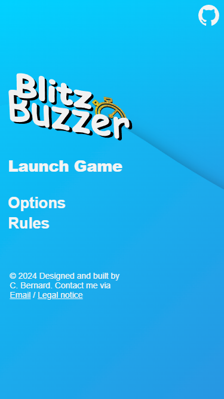
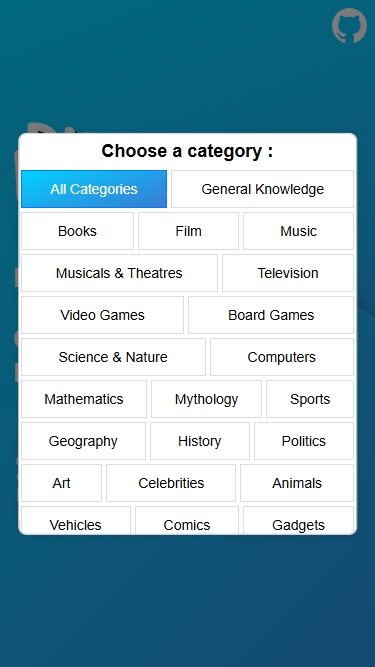
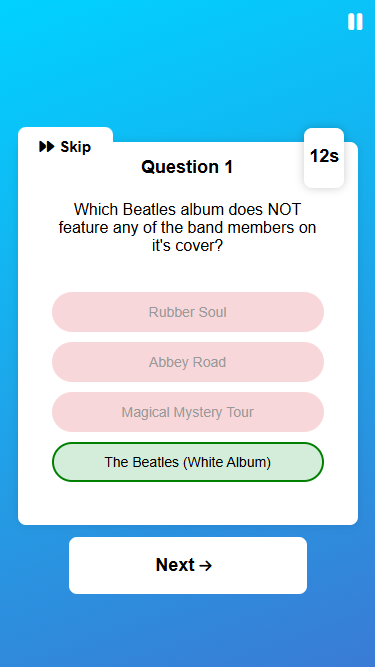

# BlitzBuzzer

## Description:
BlitzBuzzer is an interactive quiz web application built using HTML, CSS, and JavaScript, with dynamic questions fetched from the Open Trivia Database API. The app allows users to select question categories and adjusts the difficulty progressively for an engaging user experience. With a clean and intuitive user interface, players can focus on the challenge, improving their knowledge while enjoying a smooth game experience.

**Current Version**: 1.1.0 // [cfrbernard.github.io/Interactive-quiz/](https://cfrbernard.github.io/Interactive-quiz/)

 

  
  &nbsp;&nbsp;&nbsp;
  
  &nbsp;&nbsp;&nbsp;
  

 

---

## Key Features:
- **Dynamic Questions**: Questions are generated based on user-selected categories and increase in difficulty over time.
- **Responsive User Interface**: A simple and intuitive design ensures players can focus on the quiz without distractions.
- **Scoring System**: Scores are calculated based on the speed and accuracy of responses, adding an exciting competitive edge.
- **Skip Button**: The skip feature allows users to move past difficult questions while maintaining their active multiplier, keeping the game flow engaging.
- **No Roadmap Planned**: This project was a great exploration of API integration in front-end development. While there is room for improvement, future updates are not planned, as the focus has shifted to other projects.

---

## License:
This project is licensed under the MIT License. See the [LICENSE](LICENSE.md) file for more details.
